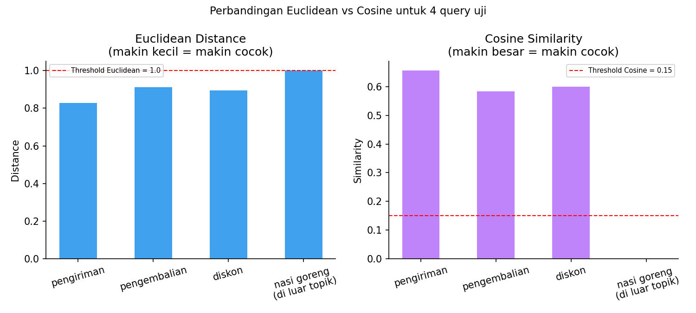

# Sistem Tanya-Jawab Sederhana dengan TF-IDF + Sastrawi

Mesin pencari FAQ untuk toko furnitur fiktif "Emerald Mabel" — mencocokkan pertanyaan user ke 20 pasang tanya-jawab menggunakan TF-IDF + stemming Bahasa Indonesia (Sastrawi).

> Dataset FAQ ini sepenuhnya **fiktif/contoh**, dipakai murni untuk demonstrasi teknik pencarian teks — bukan data toko sungguhan.

## Cara Kerja

1. **`train.py`** — preprocessing (lowercase, hapus tanda baca, stemming Sastrawi) seluruh pertanyaan+jawaban di `data.json`, lalu melatih `TfidfVectorizer` dan menyimpan hasilnya (`vectorizer.joblib`, `vector.json`).
2. **`app.py`** — CLI interaktif: user ketik pertanyaan, sistem mencari pertanyaan FAQ paling mirip lalu menampilkan jawabannya.

```bash
pip install -r requirements.txt
python train.py
python app.py
```

## Audit & Perbaikan dari Materi Asli

Materi bootcamp aslinya memakai **Euclidean distance** dengan threshold tetap (`THR = 1.0`) untuk menentukan kecocokan, dan mentransform pertanyaan user **tanpa preprocessing**. Setelah dijalankan dan diuji ulang, ditemukan dua masalah nyata:

1. **Query di luar topik bisa lolos sebagai "cocok".** Pertanyaan "resep nasi goreng enak" (tidak berhubungan sama sekali dengan FAQ furnitur) menghasilkan Euclidean distance **persis 1.0000** — tepat di angka ambang batasnya, bukan cuma "mendekati".
2. **Pertanyaan user tidak diproses dengan cara yang sama seperti data training**, sehingga overlap kata jadi lebih rendah dari seharusnya.

**Perbaikan yang diterapkan di `app.py` versi ini:**
- Pertanyaan user sekarang di-preprocess dengan fungsi yang sama persis seperti data training.
- Metrik default diganti ke **cosine similarity** dengan ambang batas kemiripan minimum (0.15), karena cosine similarity mengukur kemiripan *arah* vektor dan tidak terlalu terpengaruh oleh panjang teks — sehingga jauh lebih tegas menolak query yang tidak relevan.

> ⚠️ **Catatan jujur:** angka 0.15 di atas dipilih manual berdasarkan 4 query uji di bawah, bukan hasil tuning sistematis. Cosine similarity terbukti lebih andal untuk kasus-kasus ini, tapi bukan berarti "solved sepenuhnya" — sistem produksi sebaiknya diuji dengan variasi pertanyaan yang jauh lebih banyak sebelum mengandalkan satu angka ambang batas tetap.

### Hasil Perbandingan (Terverifikasi)

| Query Uji | Euclidean Distance | Cosine Similarity | Cocok? (Cosine) |
|---|---|---|---|
| "berapa lama pengiriman barang" | 0.8294 | 0.6560 | ✅ Ya |
| "cara mengembalikan barang yang rusak" | 0.9124 | 0.5838 | ✅ Ya |
| "apakah ada diskon" | 0.8952 | 0.5993 | ✅ Ya |
| "resep nasi goreng enak" *(di luar topik)* | **1.0000** (persis di threshold) | **0.0000** | ❌ Ditolak dengan benar |



*Angka dan grafik di atas dihasilkan dari eksekusi ulang kode di repo ini, bukan estimasi.*

## Struktur Repo

```
.
├── README.md
├── requirements.txt
├── .gitignore
├── data.json
├── train.py
├── app.py
├── faq_search_engine_demo.ipynb   # notebook eksplorasi + audit
└── images/
    └── euclidean-vs-cosine-comparison.png
```

> `vectorizer.joblib` dan `vector.json` di-generate oleh `train.py` dan sengaja tidak disertakan di repo (lihat `.gitignore`) — jalankan `train.py` untuk membuatnya ulang.

## Proyek Terkait

Materi konsep di balik TF-IDF (dan perbandingannya dengan Bag of Words serta Word2Vec) dibahas di repo terpisah: [`text-vectorizer-bow-tfidf-word2vec-arielshakaramiro`](https://github.com/arielshakaramiro/text-vectorizer-bow-tfidf-word2vec-arielshakaramiro).

---

*Bagian dari catatan belajar AI Engineering saya.*
